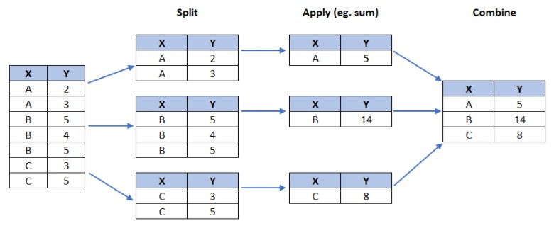

# IBM-Data-Visualization

As the saying goes, **A picture worth thousand words**. Data visualization through dashboards will help you uncover information from data that are hidden and democratize the understanding of the extracted information.

Why build visuals ?
- for explorator data analysis
- communicate data clearly
- share unbiased representation of data
- use them to support recommendation to different stackholders

When creating a visuals , always remember <a href='https://www.darkhorseanalytics.com/'>Darkhourse analytics</a> approach:
- less is more effictive
- less is more attractive
- less is more impactive

What is a line plot and why use it?
- A line chart or line plot is a type of plot which displays information as a series of data points called 'markers' connected by straight line segments. It is a basic type of chart common in many fields. Use line plot when you have a continuous data set. These are best suited for trend-based visualizations of data over a period of time.
- Line plot is a handy tool to display several dependent variables against one independent variable. However, it is recommended that no more than 5-10 lines on a single graph; any more than that and it becomes difficult to interpret.

### Histograms
- A histogram is a way of representing the frequency distribution of numeric dataset. The way it works is it partitions the x-axis into bins, assigns each data point in our dataset to a bin, and then counts the number of data points that have been assigned to each bin. So the y-axis is the frequency or the number of data points in each bin. Note that we can change the bin size and usually one needs to tweak it so that the distribution is displayed nicely.

```python
count, bin_edges = np.histogram(df_can['2013'])

print(count) # frequency count
print(bin_edges) # bin ranges, default = 10 bins
#By default, the histrogram method breaks up the dataset into 10 bins.
```
the histogram plot divid the xticks in wrong way but with us the xticks as a parameter and assign the bin_edges the x_axis will be good

#### Side Note: We could use df_can['2013'].plot.hist(), instead. In fact, throughout this lesson, using some_data.plot(kind='type_plot', ...) is equivalent to some_data.plot.type_plot(...). That is, passing the type of the plot as argument or method behaves the same


```python
#Tip: For a full listing of colors available in Matplotlib, run the following code in your python shell:

import matplotlib
for name, hex in matplotlib.colors.cnames.items():
    print(name, hex)
```

### Bar Charts (Dataframe) 
- A bar plot is a way of representing data where the length of the bars represents the magnitude/size of the feature/variable. Bar graphs usually represent numerical and categorical variables grouped in intervals.
To create a bar plot, we can pass one of two arguments via kind parameter in plot():
  - kind=bar creates a vertical bar plot
  - kind=barh creates a horizontal bar plot


### Pie Charts 
- A pie chart is a circular graphic that displays numeric proportions by dividing a circle (or pie) into proportional slices. You are most likely already familiar with pie charts as it is widely used in business and media. We can create pie charts in Matplotlib by passing in the kind=pie keyword.


### We will use pandas groupby method to summarize the immigration data by Continent. The general process of groupby involves the following steps:
- Split: Splitting the data into groups based on some criteria.
- Apply: Applying a function to each group independently: .sum() .count() .mean() .std() .aggregate() .apply() .etc..
- Combine: Combining the results into a data structure.
<br><br><br>

### Box Plots 
A box plot is a way of statistically representing the distribution of the data through five main dimensions:
    - Minimum: The smallest number in the dataset excluding the outliers.
    - First quartile: Middle number between the minimum and the median.
    - Second quartile (Median): Middle number of the (sorted) dataset.
    - Third quartile: Middle number between median and maximum.
    - Maximum: The largest number in the dataset excluding the outliers.
<br><br><br><br>


## Subplots
Often times we might want to plot multiple plots within the same figure. For example, we might want to perform a side by side comparison of the box plot with the line plot of China and India's immigration.

To visualize multiple plots together, we can create a figure (overall canvas) and divide it into subplots, each containing a plot. With subplots, we usually work with the artist layer instead of the scripting layer.

Typical syntax is :
```python
    fig = plt.figure() # create figure
    ax = fig.add_subplot(nrows, ncols, plot_number) # create subplots
```
Where:
    - nrows and ncols are used to notionally split the figure into (nrows * ncols) sub-axes,
    - plot_number is used to identify the particular subplot that this function is to create within the notional grid. plot_number starts at 1, increments across rows first and has a maximum of nrows * ncols as shown below.

### Tip regarding subplot convention
In the case when nrows, ncols, and plot_number are all less than 10, a convenience exists such that a 3-digit number can be given instead, where the hundreds represent nrows, the tens represent ncols and the units represent plot_number. For instance,
```python
   subplot(211) == subplot(2, 1, 1) 
```
produces a subaxes in a figure which represents the top plot (i.e. the first) in a 2 rows by 1 column notional grid (no grid actually exists, but conceptually this is how the returned subplot has been positioned).

> The box plot is an advanced visualizaiton tool, and there are many options and customizations that exceed the scope of this lab. Please refer to Matplotlib documentation on box plots for more information.

### Scatter Plots 
A scatter plot (2D) is a useful method of comparing variables against each other. Scatter plots look similar to line plots in that they both map independent and dependent variables on a 2D graph. While the data points are connected together by a line in a line plot, they are not connected in a scatter plot. The data in a scatter plot is considered to express a trend. With further analysis using tools like regression, we can mathematically calculate this relationship and use it to predict trends outside the dataset.


### Bubble Plots 
A bubble plot is a variation of the scatter plot that displays three dimensions of data (x, y, z). The data points are replaced with bubbles, and the size of the bubble is determined by the third variable z, also known as the weight. In maplotlib, we can pass in an array or scalar to the parameter s to plot(), that contains the weight of each point.


### Waffle Charts 
A waffle chart is an interesting visualization that is normally created to display progress toward goals. It is commonly an effective option when you are trying to add interesting visualization features to a visual that consists mainly of cells, such as an Excel dashboard.
Unfortunately, unlike R, waffle charts are not built into any of the Python visualization libraries. Therefore, we will learn how to create them from scratch.
- Step 1. The first step into creating a waffle chart is determing the proportion of each category with respect to the total.
    ```python
        # compute the proportion of each category with respect to the total
        total_values = df_dsn['Total'].sum()
        category_proportions = df_dsn['Total'] / total_values

        # print out proportions
        pd.DataFrame({"Category Proportion": category_proportions})
    ```
- Step 2. The second step is defining the overall size of the waffle chart.
    ```python
    width = 40 # width of chart
    height = 10 # height of chart

    total_num_tiles = width * height # total number of tiles

    print(f'Total number of tiles is {total_num_tiles}.')
    ```
- Step 3. The third step is using the proportion of each category to determe it respective number of tiles.
    ```python
    # compute the number of tiles for each category
    tiles_per_category = (category_proportions * total_num_tiles).round().astype(int)

    # print out number of tiles per category
    pd.DataFrame({"Number of tiles": tiles_per_category})
    ```
- Step 4. The fourth step is creating a matrix that resembles the waffle chart and populating it.
    ```python
    # initialize the waffle chart as an empty matrix
    waffle_chart = np.zeros((height, width), dtype = np.uint)

    # define indices to loop through waffle chart
    category_index = 0
    tile_index = 0

    # populate the waffle chart
    for col in range(width):
        for row in range(height):
            tile_index += 1

            # if the number of tiles populated for the current category is equal to its corresponding allocated tiles...
            if tile_index > sum(tiles_per_category[0:category_index]):
                # ...proceed to the next category
                category_index += 1       

            # set the class value to an integer, which increases with class
            waffle_chart[row, col] = category_index

    print ('Waffle chart populated!')
    ```
- Step 5. Map the waffle chart matrix into a visual.
    ```python
    # instantiate a new figure object
    fig = plt.figure()

    # use matshow to display the waffle chart
    colormap = plt.cm.coolwarm
    plt.matshow(waffle_chart, cmap=colormap)
    plt.colorbar()
    plt.show()
    ```
- Step 6. Prettify the chart.
    ```python
    # instantiate a new figure object
    fig = plt.figure()

    # use matshow to display the waffle chart
    colormap = plt.cm.coolwarm
    plt.matshow(waffle_chart, cmap=colormap)
    plt.colorbar()

    # get the axis
    ax = plt.gca()

    # set minor ticks
    ax.set_xticks(np.arange(-.5, (width), 1), minor=True)
    ax.set_yticks(np.arange(-.5, (height), 1), minor=True)

    # add gridlines based on minor ticks
    ax.grid(which='minor', color='w', linestyle='-', linewidth=2)

    plt.xticks([])
    plt.yticks([])
    plt.show()
    ```
- Step 7. Create a legend and add it to chart.
    ```python
    # instantiate a new figure object
    fig = plt.figure()

    # use matshow to display the waffle chart
    colormap = plt.cm.coolwarm
    plt.matshow(waffle_chart, cmap=colormap)
    plt.colorbar()

    # get the axis
    ax = plt.gca()

    # set minor ticks
    ax.set_xticks(np.arange(-.5, (width), 1), minor=True)
    ax.set_yticks(np.arange(-.5, (height), 1), minor=True)

    # add gridlines based on minor ticks
    ax.grid(which='minor', color='w', linestyle='-', linewidth=2)

    plt.xticks([])
    plt.yticks([])

    # compute cumulative sum of individual categories to match color schemes between chart and legend
    values_cumsum = np.cumsum(df_dsn['Total'])
    total_values = values_cumsum[len(values_cumsum) - 1]

    # create legend
    legend_handles = []
    for i, category in enumerate(df_dsn.index.values):
        label_str = category + ' (' + str(df_dsn['Total'][i]) + ')'
        color_val = colormap(float(values_cumsum[i])/total_values)
        legend_handles.append(mpatches.Patch(color=color_val, label=label_str))

    # add legend to chart
    plt.legend(handles=legend_handles,
               loc='lower center', 
               ncol=len(df_dsn.index.values),
               bbox_to_anchor=(0., -0.2, 0.95, .1)
              )
    plt.show()
    ```
There seems to be a new Python package for generating waffle charts called <a href='https://github.com/gyli/PyWaffle'>PyWaffle</a>, but it looks like the repository is still being built. But feel free to check it out and play with it.

### Word Clouds 
Word clouds (also known as text clouds or tag clouds) work in a simple way: the more a specific word appears in a source of textual data (such as a speech, blog post, or database), the bigger and bolder it appears in the word cloud.

Luckily, a Python package already exists in Python for generating word clouds. The package, called word_cloud was developed by Andreas Mueller. You can learn more about the package by following this <a href='https://github.com/amueller/word_cloud/'>link</a>.
Another cool thing you can implement with the word_cloud package is superimposing the words onto a mask of any shape. Let's use a mask of Alice and her rabbit. We already created the mask for you, so let's go ahead and download it and call it alice_mask.png.

## Introduction to Folium 
Folium is a powerful Python library that helps you create several types of Leaflet maps. The fact that the Folium results are interactive makes this library very useful for dashboard building.

From the official Folium documentation page:

```
Folium builds on the data wrangling strengths of the Python ecosystem and the mapping strengths of the Leaflet.js library. Manipulate your data in Python, then visualize it in on a Leaflet map via Folium.
```
```
Folium makes it easy to visualize data that's been manipulated in Python on an interactive Leaflet map. It enables both the binding of data to a map for choropleth visualizations as well as passing Vincent/Vega visualizations as markers on the map.
```
```
The library has a number of built-in tilesets from OpenStreetMap, Mapbox, and Stamen, and supports custom tilesets with Mapbox or Cloudmade API keys. Folium supports both GeoJSON and TopoJSON overlays, as well as the binding of data to those overlays to create choropleth maps with color-brewer color schemes.
```

## Choropleth Maps 
A Choropleth map is a thematic map in which areas are shaded or patterned in proportion to the measurement of the statistical variable being displayed on the map, such as population density or per-capita income. The choropleth map provides an easy way to visualize how a measurement varies across a geographic area, or it shows the level of variability within a region. Below is a Choropleth map of the US depicting the population by square mile per state.

### Regression Plots

> Seaborn is a Python visualization library based on matplotlib. It provides a high-level interface for drawing attractive statistical graphics. You can learn more about seaborn by following this link and more about seaborn regression plots by following this link.

In lab Pie Charts, Box Plots, Scatter Plots, and Bubble Plots, we learned how to create a scatter plot and then fit a regression line. It took ~20 lines of code to create the scatter plot along with the regression fit. In this final section, we will explore seaborn and see how efficient it is to create regression lines and fits using this library!


# Additional Resources for Dash
To learn more about Dash, explore
<a href="https://dash.plotly.com/">Complete dash user guide</a><br>
<a href="https://dash.plotly.com/dash-core-components">Dash core components</a><br>
<a href="https://dash.plotly.com/dash-html-components">Dash HTML components</a><br>
<a href="https://community.plotly.com/c/dash/16">Dash community forum</a><br>
<a href="https://medium.com/plotly/tagged/dash">Related blogs</a><br>


# Additional Resources for Interactive Dashboards
To learn more about making interactive dashboards in Dash, visit
<a href="https://realpython.com/primer-on-python-decorators/">Python decorators reference 1</a><br>
<a href="https://www.python.org/dev/peps/pep-0318/#current-syntax">Python decorators reference 2</a><br>
<a href="https://dash.plotly.com/basic-callbacks">Callbacks with example</a><br>
<a href="https://dash-gallery.plotly.host/Portal/">Dash app gallery</a><br>
<a href="https://plotly.com/dash-community-components/">Dash community components</a><br>


Since it's not always easy to decide how to best tell the story behind your data, we've broken the chart types into three broad categories to help with this.
- Trends - A trend is defined as a pattern of change.
    - `Line charts` are best to show trends over a period of time, and multiple lines can be used to show trends in more than one group.
- Relationship - There are many different chart types that you can use to understand relationships between variables in your data.
    - `Bar charts` are useful for comparing quantities corresponding to different groups.
    - `Heatmaps` can be used to find color-coded patterns in tables of numbers.
    - `Scatter plots` show the relationship between two continuous variables; if color-coded / bubble, we can also show the relationship with a third categorical variable.
    - `regplot`  Including a regression line in the scatter plot makes it easier to see any linear relationship between two variables.
    - `swarmplot` Categorical scatter plots show the relationship between a continuous variable and a categorical variable.
- Distribution - We visualize distributions to show the possible values that we can expect to see in a variable, along with how likely they are.
    - `Histograms` show the distribution of a single numerical variable.
    - `KDE plots (or 2D KDE plots)` show an estimated, smooth distribution of a single numerical variable (or two numerical variables).
    - `jointplot` - This command is useful for simultaneously displaying a 2D KDE plot with the corresponding KDE plots for each individual variable.


# The top 7 used chart types:
- Bar Chart
    - When to use:
        1. Comparing parts of a bigger set of data, highlighting different categories, or showing change over time.
        2. Have long categories label — it offers more space.
        3. If you want to illustrate both positive and negative values in the dataset.
    - when to avoid:
        1. If you’re using multiple data points.
        2. If you have many categories, avoid overloading your graph. Your graph shouldn’t have more than 10 bars.
- Pie Chart
    - When to use:
        1. When you show relative proportions and percentages of a whole dataset.
        2. Best used with small datasets — also applies to donut charts.
        3. When comparing the effect of ONE factor on different categories.
        4. If you have up to 6 categories.
        5. When your data is nomial and not ordinal.
    - When to Avoid:
        1. If you have a big dataset.
        2. If you want to make a precise or absolute comparison between values.
- Line Chart
    - When to use:
        1. If you have a continuous dataset that changes over time.
        2. If your dataset is too big for a bar chart.
        3. If you want to display multiple series for the same timeline.
        4. If you want to visualize trends instead of exact values.
    - When to avoid:
        1. Line charts work better with bigger datasets, so, if you have a small one, use a bar chart instead.
- Scatter Plot
    - When to use:
        1. To show correlation and clustering in big datasets.
        2. If your dataset contains points that have a pair of values.
        3. If the order of points in the dataset is not essential.
    - When to avoid:
        1. If you have a small dataset.
        2. If the values in your dataset are not correlated.
- Area Chart
    - When to use:
        1. If you want to show part-to-whole relations.
        2. If you want to portray the volume of your data and not just the relation to time.
    - When to avoid:
        1. It can’t be used with discrete data.
- Bubble Chart 
    - When to use:
        1. If you want to compare independent values.
        2. If you want to show distribution or relation.
    - When to avoid:
        1. If you have a small dataset.

# Chart selection tips
1. If you have categorical data, use a bar chart if you have more than 5 categories or a pie chart otherwise.
2. If you have nominal data, use bar charts or histograms if your data is discrete, or line/ area charts if it is continuous.
3. If you want to show the relationship between values in your dataset, use a scatter plot, bubble chart, or line charts.
4. If you want to compare values, use a pie chart — for relative comparison — or bar charts — for precise comparison.
5. If you want to compare volumes, use an area chart or a bubble chart.
6. If you want to show trends and patterns in your data, use a line chart, bar chart, or scatter plot.
